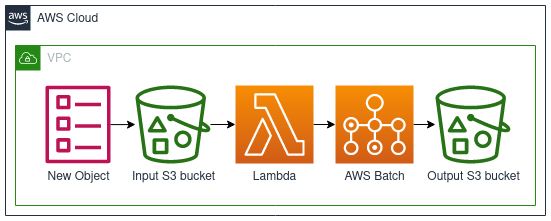

# AWS GDAL Robot
A proof of concept implementation of running GDAL based jobs in AWS

Structure:
* [`convert`](convert/) - A GDAL/rasterio container based job that converts an S3 object to a Cloud Optimised GeoTiff
* [`lambda`](lambda/) - An AWS Lambda function that will trigger the above container to run in AWS Batch
* [`deploy`](deploy/) - CDK constructs for configuration of S3, Lambda, and Batch.

# TODO

- [x] Separate input/output buckets
- [x] Basic filtering so it only triggers on tif files
- [ ] SNS notifications if batch job fails